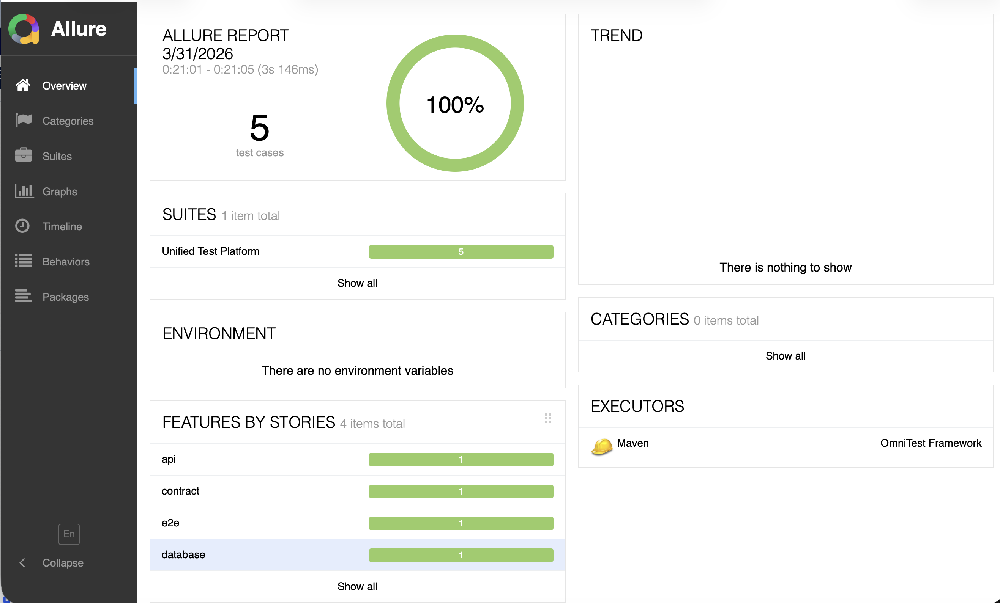
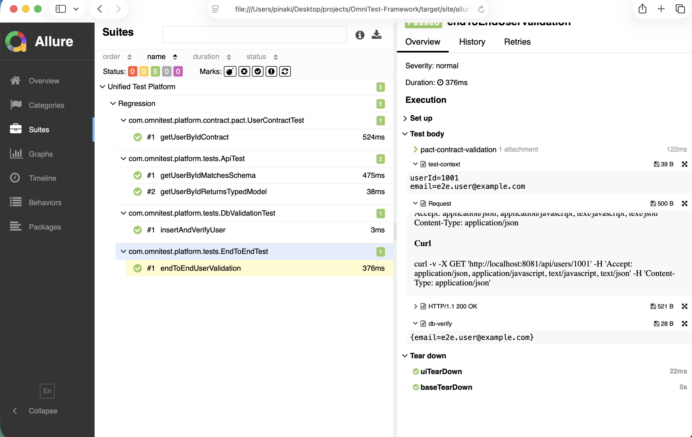

# OmniTest Framework

**Unified Test Automation Platform — one place to validate UI, API, database, and contracts seamlessly.**

## Overview

**OmniTest Framework** is a modular, CI-friendly test stack for end-to-end validation across layers: **UI (Playwright)** → **HTTP APIs (REST Assured)** → **relational data (JDBC + HikariCP)** → **consumer-driven contracts (Pact)**. It uses **Java 17**, **TestNG**, **Maven**, **Allure** reporting, and **Log4j2** logging, with environment-specific **YAML** configuration and **Docker Compose** for local dependencies.

## Repository layout

| Path | Purpose |
|------|---------|
| [`pom.xml`](pom.xml) | Maven build (dependencies, Surefire, Allure, Playwright exec) |
| [`src/main/java`](src/main/java) | Framework code, page objects, clients, tests, and utilities |
| [`src/test/resources`](src/test/resources) | `config.yaml`, TestNG suite, schemas, test data, Log4j2 |
| [`docker/`](docker/) | Compose file, Postgres init, WireMock mappings, nginx demo UI |
| [`.github/workflows/ci.yml`](.github/workflows/ci.yml) | CI: JDK 17, Playwright install, Docker, tests, Allure + pact artifacts |
| [`docs/images/`](docs/images/) | README reference screenshots (Allure report examples) |
| [`LICENSE`](LICENSE) | MIT License |

## Architecture

```
┌─────────────────────────────────────────────────────────────────┐
│                     TestNG + Allure + Log4j2                     │
└────────────────────────────┬────────────────────────────────────┘
                             │
        ┌────────────────────┼────────────────────┐
        ▼                    ▼                    ▼
 ┌─────────────┐     ┌─────────────┐     ┌──────────────┐
 │  UI (POM)   │     │ REST Assured │     │ JDBC + Pool  │
 │ Playwright  │     │ + clients    │     │ QueryExecutor│
 └──────┬──────┘     └──────┬───────┘     └──────┬───────┘
        │                   │                     │
        └───────────┬───────┴──────────┬──────────┘
                    ▼                  ▼
            ┌──────────────┐   ┌─────────────────┐
            │ TestContext  │   │ Pact + MockSrv  │
            │ (ThreadLocal)│   │ (contracts)     │
            └──────────────┘   └─────────────────┘
                    │
                    ▼
            ┌───────────────────────────┐
            │ Docker: Postgres +        │
            │ WireMock + demo UI (nginx)│
            └───────────────────────────┘
```

## Features

| Area | Capabilities |
|------|----------------|
| **UI** | Page Object Model, reusable `UIActions`, Playwright auto-waits, failure screenshots to Allure |
| **API** | REST Assured client abstraction, request/response logging (Log4j2), JSON Schema validation |
| **DB** | HikariCP pool, `QueryExecutor` for parameterized SQL, assertions after API/UI steps |
| **Contract** | Pact consumer tests with embedded mock provider; pact JSON under `target/pacts` |

## Tech stack

| Component | Technology |
|-----------|------------|
| Language | Java 17 |
| Tests | TestNG |
| Build | Maven |
| UI | Playwright (Java) |
| API | REST Assured + json-schema-validator |
| Database | JDBC, HikariCP, PostgreSQL / MySQL drivers |
| Contracts | Pact JVM (`au.com.dius.pact:consumer`) |
| Reporting | Allure |
| Logging | Log4j2 |
| Config | YAML (`config.yaml`) + `ConfigManager` |
| CI | GitHub Actions |
| Local services | Docker Compose (Postgres, WireMock, nginx demo UI) |

## How it works

1. **Config** resolves environment from `ENV` or `-Denv` (default `dev`) and loads `src/test/resources/config.yaml`.
2. **TestContext** (thread-local) carries identifiers (for example `userId`, `email`) across UI, API, and DB steps.
3. **End-to-end** tests drive the browser against the demo UI; the UI calls the WireMock-backed API; tests assert via REST Assured, **JDBC**, and Pact consumer verification (embedded **MockServer**).
4. **Allure** collects steps, API attachments (`AllureRestAssured`), DB text attachments, screenshots on failure, and contract notes.

## Setup

1. **JDK 17** and **Maven 3.9+**
2. Clone this repository and work from the **repository root** (where `pom.xml` lives).
3. Install Playwright browsers for the Java binding (once per machine):

```bash
mvn exec:java -e -Dexec.mainClass=com.microsoft.playwright.CLI -Dexec.args="install"
```

On Linux CI or when system deps are missing, use `install --with-deps` (see [`.github/workflows/ci.yml`](.github/workflows/ci.yml)).

4. Start local dependencies:

```bash
docker compose -f docker/docker-compose.yml up -d
```

5. Optional: set environment (defaults to `dev`):

```bash
export ENV=dev
```

## Running tests

From the repository root:

```bash
mvn clean test
```

- **Suite file**: `src/test/resources/testng.xml` (groups: `smoke`, `regression`, `contract`).
- **Parallelism**: suite defaults to `parallel="false"` for stable JDBC usage; adjust in `testng.xml` if needed.
- **Retry**: opt in per test with `@Test(retryAnalyzer = com.omnitest.platform.utils.RetryAnalyzer.class)`.
- **Allure report** (after a test run):

```bash
mvn allure:report
```

Open the report in a browser (Allure Maven writes under `allure-maven-plugin`):

```bash
open target/site/allure-maven-plugin/index.html
```

On Linux, use `xdg-open`; on Windows, open the same path in Explorer. The exact subfolder under `target/site/` can vary slightly by plugin version; if needed, look for `index.html` under `target/site/`.

## CI/CD integration

The workflow [`.github/workflows/ci.yml`](.github/workflows/ci.yml) runs on push and pull request to `master` / `main`:

- JDK 17 with Maven cache
- Playwright browser install (`com.microsoft.playwright.CLI`)
- Docker Compose (Postgres, WireMock, demo UI)
- `mvn clean test` at repo root
- `mvn allure:report`, with artifacts for **Allure** (`target/site/allure-maven-plugin/`) and **Pact contracts** (`target/pacts`)

## Sample report output

After `mvn test` and `mvn allure:report`, open `target/site/allure-maven-plugin/index.html` in a browser (path is relative to the repo root; the `target/` folder is created by Maven). The screenshots below show what a successful report looks like.

### Overview dashboard

The **Overview** page summarizes the latest run: total test cases, pass rate, suite name, and **Features by stories** (grouped by Allure `@Feature` / `@Story`, for example API, contract, E2E, database). Trend and categories may be empty on a first local run.



### Suites and test detail

The **Suites** view lists tests by package and class. Selecting a method shows the **Test body**: steps such as Pact validation, REST **Request** / **HTTP** attachments, **test-context** and **db-verify** text, plus setup and teardown (for example `uiTearDown`, `baseTeardown`).



In general, the report also includes:

- **Behaviors**: another way to browse by feature/story
- **Attachments**: REST request/response, DB row dumps, Pact summary text, UI screenshots on failure
- **Timeline**: TestNG method ordering and duration

## Future enhancements

- Provider-side Pact verification and Pact Broker publishing
- Testcontainers for on-demand Postgres/WireMock in CI
- Separate `smoke` vs `full` Maven profiles and TestNG suite files
- Centralized secret management for non-local environments

## License

This project is released under the [MIT License](LICENSE).

Copyright (c) 2026 Pinaki Nandan Hota
